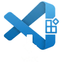

# VS Code VSIX Downloader - Chrome Extension

  

This extension adds a convenient "Download VSIX" button directly to Visual Studio Code Marketplace pages. This allows you to download extensions as .vsix files to install them manually instead of installing directly through the browser prompt.

## Features
- Injects a **Download VSIX** button next to the standard Install button.
- Dynamically extracts the required version, publisher, and identifier to generate the direct download link from Microsoft's asset endpoints.
- Runs purely as a content script without background overhead.
- Safe cross-origin fetch to ensure the .vsix is saved with the correct identifier-version.vsix filename.

## How to Install (Developer Mode)

### Chrome, Edge, and Brave (Chromium)

If you have downloaded or cloned this repository:

1. Open Google Chrome, Edge, or Brave.
2. In the address bar, go to `chrome://extensions/` (or `edge://extensions/`).
3. Turn on the **Developer mode** toggle in the top-right corner.
4. Click the **Load unpacked** button in the top-left area.
5. Select this folder (containing the `manifest.json`).
6. The extension should now be active and visible in your extensions list.

### Mozilla Firefox

Firefox uses Manifest V2, so you need to swap the manifest files before loading:

1. Download or clone this repository.
2. Rename `manifest.json` to `manifest-chrome.json` (or delete it).
3. Rename `manifest-firefox.json` to `manifest.json`.
4. Open Firefox and go to `about:debugging#/runtime/this-firefox`.
5. Click **Load Temporary Add-on...**
6. Select the `manifest.json` file inside the extension folder.
7. The extension should now be active.

### Tampermonkey / Greasemonkey (Userscript)

If you don't want to install a full browser extension, you can run this purely as a Userscript! It will also automatically detect and install updates when new versions are pushed to this repository.

1. Install a userscript manager like **Tampermonkey** or **Violentmonkey**.
2. Click **[this link](https://raw.githubusercontent.com/ShixAJ/vscode-vsix-downloader/master/userscript.user.js)** to view the raw userscript.
3. Your userscript manager will automatically detect the metadata headers and prompt you to install it. Click **Install**.
4. The script will now automatically run on Visual Studio Marketplace pages and check for updates periodically.

## How to Use

1. Navigate to any extension page on the Visual Studio Code Marketplace.
   *Example: [Better SVG](https://marketplace.visualstudio.com/items?itemName=midudev.better-svg)*
2. Wait a second for the page to fully load.
3. You will see a blue **Download VSIX** button appear next to the installation area.
4. Click the button to immediately download the .vsix package to your local downloads folder.
5. To install the downloaded VSIX in VS Code:
   - Open VS Code.
   - Go to the Extensions view (Ctrl+Shift+X).
   - Click the ... menu in the top right of the Extensions view.
   - Select **Install from VSIX...** and choose the downloaded file.

## Technical Details

The extension uses the same logic as the V2 script from [zhengxiongzhao/VSCode-VSIX-Download](https://github.com/zhengxiongzhao/VSCode-VSIX-Download):
1. Reads the metadata table (specifically looking for Version, Publisher, and Unique Identifier).
2. Generates a download URL pointing to https://[publisher].gallery.vsassets.io/_apis/public/gallery/publisher/[publisher]/extension/[extension]/[version]/assetbyname/Microsoft.VisualStudio.Services.VSIXPackage.
3. Injects a native button invoking an invisible <a> element to trigger a system download rather than a navigation.
